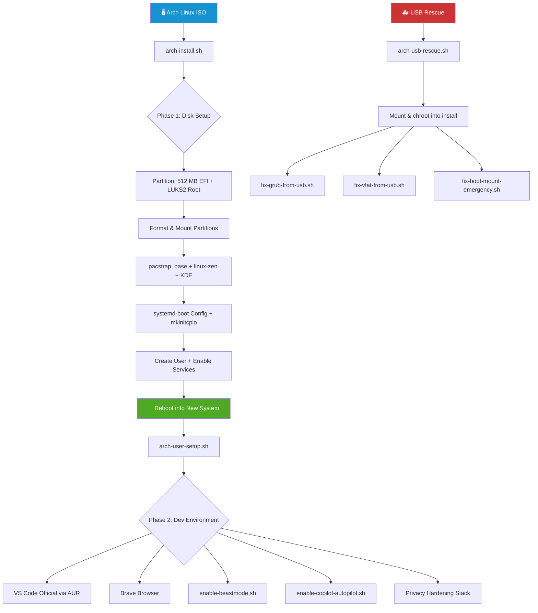
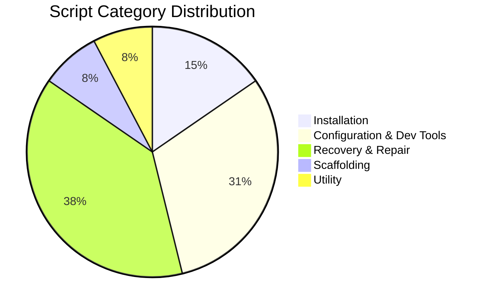
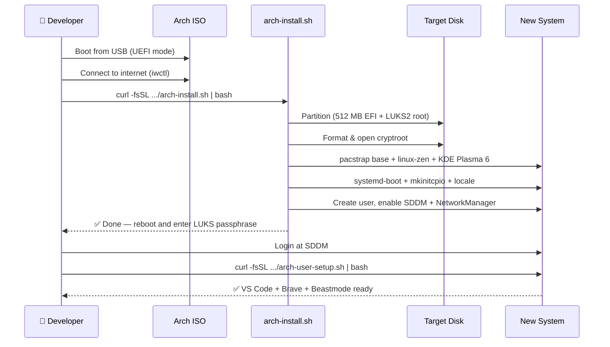
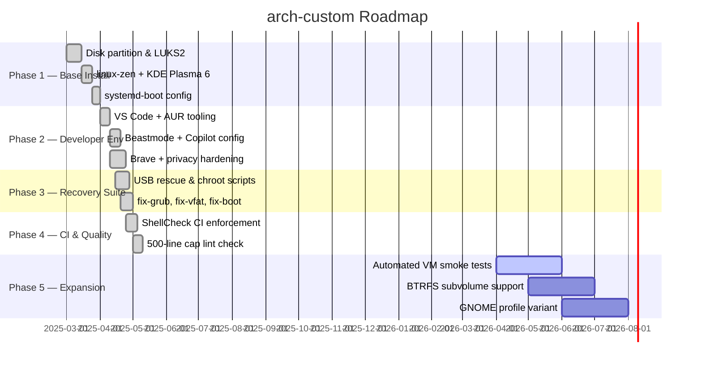

<div align="center">
  <h1>🏹 arch-custom</h1>
  <p><em>One-command Arch Linux installer — Zen kernel, KDE Plasma 6, LUKS2 encryption, and a fully wired developer environment, curlable from any Arch ISO.</em></p>
</div>

<div align="center">

[](LICENSE)
[](https://github.com/hkevin01/arch-custom/commits/main)
[](https://github.com/hkevin01/arch-custom)
[](https://www.gnu.org/software/bash/)
[](https://archlinux.org)
[](https://kde.org/plasma-desktop/)
[](https://github.com/hkevin01/arch-custom/issues)

</div>

---

## Table of Contents

- [Overview](#overview)
- [Key Features](#key-features)
- [Architecture](#architecture)
- [Script Distribution](#script-distribution)
- [Installation Flow](#installation-flow)
  - [Step 1 — Base Install](#step-1--base-install)
  - [Step 2 — First Login Setup](#step-2--first-login-setup)
  - [Step 3 — Scaffold Any Project](#step-3--scaffold-any-project)
- [Curlable Scripts](#curlable-scripts)
- [Technology Stack](#technology-stack)
- [USB Rescue & Recovery](#usb-rescue--recovery)
- [Core Capabilities](#core-capabilities)
- [Project Roadmap](#project-roadmap)
- [Development Status](#development-status)
- [Contributing](#contributing)
- [License](#license)

---

## Overview

**arch-custom** is a collection of battle-tested Bash scripts that automate the complete Arch Linux setup lifecycle — from raw disk to a privacy-hardened, developer-ready desktop — in a single `curl | bash` command.

It targets solo developers, power users, and teams who want a reproducible, opinionated Arch Linux environment without manual configuration overhead. Every script is idempotent, ShellCheck-clean, and designed to run safely against a clean Arch ISO or a live system.

> [!IMPORTANT]
> These scripts partition and format disks. **Back up all data before running `arch-install.sh` on any machine.** The installer targets `/dev/mmcblk0` by default — override with the `TARGET_DISK` environment variable before running.

**Domain:** Linux automation / DevOps / Developer tooling
**Who it is for:** Developers who reinstall frequently, homelab engineers, privacy-conscious power users, and AI-assisted development workflows (VS Code + GitHub Copilot Beastmode).

<p align="right">(<a href="#top">back to top ↑</a>)</p>

---

## Key Features

| Icon | Feature | Description | Impact | Status |
|------|---------|-------------|--------|--------|
| 🔒 | LUKS2 Full-Disk Encryption | Root partition encrypted at rest; passphrase prompted at boot | Data security at rest | ✅ Stable |
| ⚡ | linux-zen Kernel | Desktop-optimised kernel with low-latency and performance patches | Snappier desktop UX | ✅ Stable |
| 🖥️ | KDE Plasma 6 + SDDM | Full Wayland-capable desktop with automatic dark-mode configuration | Zero manual KDE setup | ✅ Stable |
| 🔁 | Idempotent One-liners | Every script can be re-run: skips already-completed steps automatically | Safe to run twice | ✅ Stable |
| 🤖 | Copilot Beastmode | Pre-wires VS Code Copilot agents and chatmodes for autonomous development | Instant AI dev env | ✅ Stable |
| 🛠️ | Project Bootstrapper | Scaffolds memory-bank, CI, .vscode, .github, .copilot, and docs for any project | Consistent repo setup | ✅ Stable |
| 🚑 | USB Rescue Suite | Reinstall bootloader, fix vfat, chroot-repair — all from an Arch USB stick | System recovery | ✅ Stable |
| 🎨 | KDE Dark Theme Fix | Auto-applies GTK/QT dark-theme integration so apps are visually consistent | GTK app theming | ✅ Stable |

- **Privacy-first defaults**: Brave browser, tracking-protection stack, and KDE lockscreen privacy hardening deployed automatically during first-login setup.
- **AUR-native tooling**: Installs `visual-studio-code-bin` (the official Microsoft VS Code) via AUR, with automatic fallback handling.
- **ShellCheck CI**: All scripts are linted on every push. Zero shellcheck warnings are enforced by GitHub Actions.
- **Configurable targets**: `TARGET_DISK`, `DEFAULT_PASS`, and other variables are overridable via environment before piping to bash.

<p align="right">(<a href="#top">back to top ↑</a>)</p>

---

## Architecture

The project is structured as three concentric layers: **Installation**, **Configuration**, and **Recovery**.



**Component responsibilities:**

| Layer | Scripts | Responsibility |
|-------|---------|----------------|
| Installation | `arch-install.sh`, `arch-config.sh` | Disk partition, LUKS2, base system, KDE, bootloader |
| Configuration | `arch-user-setup.sh`, `enable-beastmode.sh`, `enable-copilot-autopilot.sh`, `kde-dark-theme-fix.sh` | Post-login developer tools, AI tooling, theming |
| Scaffolding | `project-bootstrap.sh` | Reproducible project structure for any repository |
| Recovery | `arch-usb-rescue.sh`, `arch-usb-repair-all.sh`, `fix-*` | Chroot repair, bootloader reinstall, vfat fixes |

**External integrations:** AUR (yay/makepkg), GitHub raw content CDN (curlable delivery), shields.io badges, systemd, cryptsetup, pacman.

<p align="right">(<a href="#top">back to top ↑</a>)</p>

---

## Script Distribution



| Category | Count | Scripts |
|----------|-------|---------|
| Installation | 2 | `arch-install.sh`, `arch-config.sh` |
| Configuration & Dev Tools | 4 | `arch-user-setup.sh`, `enable-beastmode.sh`, `enable-copilot-autopilot.sh`, `kde-dark-theme-fix.sh` |
| Recovery & Repair | 5 | `arch-usb-rescue.sh`, `arch-usb-repair-all.sh`, `fix-grub-from-usb.sh`, `fix-vfat-from-usb.sh`, `fix-boot-mount-debug.sh` |
| Scaffolding | 1 | `project-bootstrap.sh` |
| Utility | 1 | `fix-boot-mount-emergency.sh` |

<p align="right">(<a href="#top">back to top ↑</a>)</p>

---

## Installation Flow



### Step 1 — Base Install

Boot from Arch Linux ISO, connect to the internet, then run:

```bash
curl -fsSL https://raw.githubusercontent.com/hkevin01/arch-custom/main/arch-install.sh | bash
```

> [!TIP]
> Override the target disk before running if your system does not use `/dev/mmcblk0`:
> ```bash
> export TARGET_DISK=/dev/sda
> curl -fsSL https://raw.githubusercontent.com/hkevin01/arch-custom/main/arch-install.sh | bash
> ```

After the script completes, unmount and reboot:

```bash
umount -R /mnt
cryptsetup close cryptroot
reboot
```

On first boot:
1. Enter your LUKS encryption passphrase at the prompt
2. Log in at the SDDM display manager

### Step 2 — First Login Setup

After rebooting into the new system, run as your normal user (not root):

```bash
curl -fsSL https://raw.githubusercontent.com/hkevin01/arch-custom/main/arch-user-setup.sh | bash
```

This installs VS Code (official Microsoft build), Brave browser, Beastmode, Copilot autopilot settings, and the full privacy-hardening stack.

### Step 3 — Scaffold Any Project

Run inside any project directory to add `memory-bank`, CI, `.vscode`, `.github`, `.copilot`, and `docs`:

```bash
curl -fsSL https://raw.githubusercontent.com/hkevin01/arch-custom/main/project-bootstrap.sh | bash
```

Or target a specific directory:

```bash
curl -fsSL https://raw.githubusercontent.com/hkevin01/arch-custom/main/project-bootstrap.sh | bash -s -- /path/to/project
```

<p align="right">(<a href="#top">back to top ↑</a>)</p>

---

## Curlable Scripts

All scripts are delivered over GitHub raw content and designed to be piped directly into bash from any Arch environment.

| Script | Category | Purpose |
|--------|----------|---------|
| `arch-install.sh` | Installation | Full Arch install: LUKS2, linux-zen, KDE Plasma 6, systemd-boot |
| `arch-config.sh` | Installation | Post-install system configuration and hardening |
| `arch-user-setup.sh` | Configuration | First-login: VS Code, Brave, Beastmode, privacy tools |
| `enable-beastmode.sh` | Configuration | VS Code Beastmode agent + chatmode installer |
| `enable-copilot-autopilot.sh` | Configuration | Copilot agent settings (auto-installs jq) |
| `kde-dark-theme-fix.sh` | Configuration | GTK/QT dark-theme fix for KDE |
| `project-bootstrap.sh` | Scaffolding | Scaffold any project with memory-bank, CI, .vscode |
| `arch-usb-rescue.sh` | Recovery | Chroot into LUKS install from USB: WiFi + boot repair |
| `arch-usb-repair-all.sh` | Recovery | Full repair sweep from USB rescue environment |
| `fix-grub-from-usb.sh` | Recovery | Reinstall GRUB EFI bootloader from Arch USB |
| `fix-vfat-from-usb.sh` | Recovery | Repair VFAT EFI partition from USB |
| `fix-boot-mount-debug.sh` | Recovery | Debug boot mount failures with verbose output |
| `fix-boot-mount-emergency.sh` | Recovery | Emergency single-command boot mount repair |

<p align="right">(<a href="#top">back to top ↑</a>)</p>

---

## Technology Stack

| Technology | Purpose | Why Chosen | Alternatives Considered |
|------------|---------|------------|------------------------|
| Bash | All scripting | Universal on any Arch ISO; no runtime deps | Python (too heavy for early-boot), POSIX sh (too limited) |
| linux-zen | Kernel | Desktop-optimised, low-latency patches baked in | linux (mainline), linux-lts (too conservative) |
| KDE Plasma 6 | Desktop | Wayland-native, highly configurable, active upstream | GNOME (less configurable), Sway (no GUI config) |
| LUKS2 + cryptsetup | Disk encryption | Industry standard; systemd-boot + initramfs integration | VeraCrypt (no initramfs hooks), plain dm-crypt |
| systemd-boot | Bootloader | UEFI-native, zero config overhead, fast boot times | GRUB (heavier, more config required) |
| PipeWire | Audio | Drop-in PulseAudio replacement; lower latency, better Bluetooth | PulseAudio (legacy), JACK (pro-audio only) |
| GitHub Actions | CI/CD | Free, native GitHub integration, fast shellcheck runs | GitLab CI, Circle CI |
| ShellCheck | Linting | Catches shell pitfalls and portability issues automatically | Bash-lint (less comprehensive) |

<p align="right">(<a href="#top">back to top ↑</a>)</p>

---

## USB Rescue & Recovery

<details>
<summary>🚑 Full USB Rescue Procedure</summary>

Boot from an Arch Linux USB stick in **UEFI mode**, connect to Wi-Fi, then run:

```bash
# Full automated rescue (mounts, chroots, reinstalls boot)
curl -fsSL https://raw.githubusercontent.com/hkevin01/arch-custom/main/arch-usb-rescue.sh | sudo bash
```

**To target a different disk** (default is `/dev/mmcblk0`):

```bash
export TARGET_DISK=/dev/sda
export EFI_PART=/dev/sda1
export ROOT_PART=/dev/sda2
curl -fsSL https://raw.githubusercontent.com/hkevin01/arch-custom/main/arch-usb-rescue.sh | sudo bash
```

**Bootloader-only repair:**

```bash
LUKS_PASSPHRASE=yourpass sudo bash fix-grub-from-usb.sh
```

**vfat / EFI partition repair:**

```bash
sudo bash fix-vfat-from-usb.sh
```

**Debug boot mount failures:**

```bash
sudo bash fix-boot-mount-debug.sh
```

</details>

<details>
<summary>📋 Recovery Script Environment Variables</summary>

| Variable | Default | Description |
|----------|---------|-------------|
| `TARGET_DISK` | `/dev/mmcblk0` | Target block device |
| `EFI_PART` | `${TARGET_DISK}p1` | EFI partition |
| `ROOT_PART` | `${TARGET_DISK}p2` | LUKS root partition |
| `CRYPT_NAME` | `cryptroot` | dm-crypt mapper name |
| `DEFAULT_PASS` | `password` | Fallback LUKS passphrase (override this!) |
| `LUKS_PASSPHRASE` | _(empty)_ | Pass via env to skip interactive prompt |
| `PASS_ATTEMPTS` | `3` | Max passphrase retry attempts |

> [!WARNING]
> Always set `DEFAULT_PASS` or `LUKS_PASSPHRASE` via environment variable — never hardcode passphrases in scripts or commit them to version control.

</details>

<p align="right">(<a href="#top">back to top ↑</a>)</p>

---

## Core Capabilities

### 🔒 Security & Encryption

- **LUKS2** full-disk encryption on the root partition with a passphrase prompted interactively at install time
- Password input supports both visible and hidden modes to accommodate quirky Arch ISO keyboard/console combinations
- `cryptsetup close cryptroot` enforced after install before reboot to prevent data exposure
- No hardcoded secrets in any script — all sensitive values are passed via environment variables or interactive prompt

### 🖥️ Desktop Environment Automation

KDE Plasma 6 is installed and configured non-interactively:

```bash
pacman -S --noconfirm plasma-desktop sddm plasma-nm pipewire pipewire-pulse \
  wireplumber bluedevil dolphin konsole kate ark
systemctl enable sddm NetworkManager
```

Press <kbd>Alt</kbd>+<kbd>F2</kbd> to open KRunner after first login.

### 🤖 Copilot Beastmode

`enable-beastmode.sh` deploys a pre-configured VS Code agent with access to all relevant tools for autonomous development:

```
tools: changes, codebase, editFiles, fetch, findTestFiles, new, problems,
       runInTerminal, runNotebooks, runTasks, runTests, search, searchResults,
       testFailure, usages, vscodeAPI, terminalLastCommand, terminalSelection
```

### 🏗️ Project Bootstrapper

`project-bootstrap.sh` scaffolds a consistent directory tree for any project:

```
├── memory-bank/
│   ├── implementation-plans/
│   └── architecture-decisions/
├── docs/
├── scripts/
├── data/
├── assets/
├── .github/
│   ├── workflows/
│   ├── ISSUE_TEMPLATE/
│   └── pull_request_template.md
├── .copilot/
└── .vscode/
```

> [!NOTE]
> `project-bootstrap.sh` is idempotent — it skips files that already exist, making it safe to run on an existing project to add missing scaffolding without overwriting anything.

<p align="right">(<a href="#top">back to top ↑</a>)</p>

---

## Project Roadmap



| Phase | Goals | Target | Status |
|-------|-------|--------|--------|
| Phase 1 | Disk setup, LUKS2, linux-zen, KDE, systemd-boot | Q1–Q2 2025 | ✅ Complete |
| Phase 2 | Developer tools, Copilot Beastmode, privacy hardening | Q2 2025 | ✅ Complete |
| Phase 3 | USB rescue suite, bootloader repair, vfat fix scripts | Q2 2025 | ✅ Complete |
| Phase 4 | ShellCheck CI, 500-line lint cap, project scaffold | Q2 2025 | ✅ Complete |
| Phase 5 | VM smoke tests, BTRFS support, GNOME variant | Q2–Q3 2026 | 🟡 In Progress |

<p align="right">(<a href="#top">back to top ↑</a>)</p>

---

## Development Status

| Item | Value |
|------|-------|
| Version | 1.x (main branch) |
| Stability | Stable |
| Primary Language | Bash (100%) |
| Total Scripts | 13 |
| ShellCheck Status | ✅ Zero warnings |
| CI | GitHub Actions (shellcheck + lint) |
| Line-cap Enforcement | 500 lines per script |
| Known Limitations | Scripts target UEFI only (no BIOS/MBR support); default disk is `/dev/mmcblk0` |

> [!NOTE]
> No runtime code executes on import — all scripts are plain Bash and require explicit invocation. There are no daemons, services, or background processes installed by the tooling itself.

<p align="right">(<a href="#top">back to top ↑</a>)</p>

---

## Requirements

- UEFI system (not BIOS/MBR)
- Booted from Arch Linux ISO
- Active internet connection
- At least 16 GB disk space (32 GB+ recommended for development use)

<details>
<summary>📦 Packages Installed by arch-install.sh</summary>

| Package Group | Packages |
|---------------|---------|
| Base system | `base`, `base-devel`, `linux-zen`, `linux-firmware` |
| Desktop | `plasma-desktop`, `sddm`, `plasma-nm`, `bluedevil`, `dolphin`, `konsole`, `kate`, `ark` |
| Audio | `pipewire`, `pipewire-pulse`, `pipewire-alsa`, `wireplumber` |
| Network | `networkmanager`, `iwd`, `wireless-regdb` |
| Security | `cryptsetup`, `tpm2-tools` |
| Dev tools | `git`, `curl`, `wget`, `vim`, `htop`, `neofetch` |
| Boot | `efibootmgr`, `systemd-boot` (built-in) |

</details>

<p align="right">(<a href="#top">back to top ↑</a>)</p>

---

## Contributing

Contributions are welcome. All scripts must remain ShellCheck-clean and under the 500-line cap.

<details>
<summary>📋 Contribution Workflow</summary>

```bash
# 1. Fork the repo and create a feature branch
git checkout -b feat/your-script-name

# 2. Write your script — follow existing style conventions
#    - set -euo pipefail at the top
#    - Colored output helpers: info(), ok(), warn(), die()
#    - Idempotent: check before acting, skip if already done
#    - No hardcoded secrets or credentials

# 3. Lint with ShellCheck
shellcheck your-script.sh

# 4. Verify line count
wc -l your-script.sh  # must be <= 500

# 5. Commit with a conventional message
git commit -m "feat: add your-script.sh — brief description"

# 6. Open a pull request
```

**PR Requirements:**
- [ ] `shellcheck` passes with zero warnings
- [ ] Script is idempotent (safe to run twice)
- [ ] No hardcoded passwords, tokens, or secrets
- [ ] Line count ≤ 500
- [ ] README updated if a new script is added

</details>

> [!CAUTION]
> Do not bypass the ShellCheck CI check with `# shellcheck disable` blanket suppressions. If ShellCheck flags something, fix the root cause.

<p align="right">(<a href="#top">back to top ↑</a>)</p>

---

## License

MIT — free to use, modify, and distribute. Attribution appreciated but not required.

See [LICENSE](LICENSE) for the full text.

---

<div align="center">
  Built for engineers who reinstall Arch too often.
  <br><br>
  <a href="https://github.com/hkevin01/arch-custom/stargazers">⭐ Star this repo</a> · <a href="https://github.com/hkevin01/arch-custom/issues">🐛 Report a bug</a> · <a href="https://github.com/hkevin01/arch-custom/pulls">🔧 Submit a PR</a>
</div>
